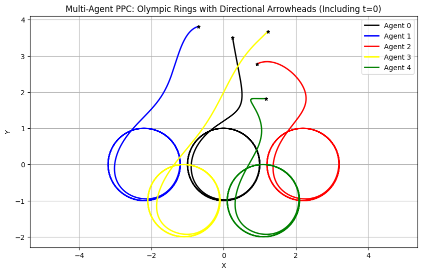

# Multi-Agent Prescribed Performance Control (PPC): Olympic Rings Formation

This repository contains a Python implementation of a multi-agent system where 5 robotic arms (2-DOF Planar Arms) collaborate to form the Olympic Games logo. 

The trajectory control is achieved using **Kinematic Prescribed Performance Control (PPC)**, which guarantees that the position tracking error remains strictly within predefined bounds.

## Key Features
* **Guaranteed Transient Performance:** The error never exceeds the prescribed boundary $\rho(t)$.
* **Singularity Awareness:** Uses the Moore-Penrose pseudo-inverse to navigate kinematic configurations.
* **Formation Scalability:** The leader-follower architecture allows for easy expansion to more agents or different shapes.

## 1. Network Topology (Leader-Follower)

The system consists of 5 agents (1 Leader + 4 Followers). The Leader traces the central circular trajectory, while the Followers track the trajectory of their respective preceding agent, adding a constant spatial offset $\Delta_{ij}$.

* **Agent 0 (Leader):** Center (Black Circle)
* **Agent 1 (Follower):** Follows Agent 0 with offset $\Delta_{10}$ (Blue Circle)
* **Agent 2 (Follower):** Follows Agent 0 with offset $\Delta_{20}$ (Red Circle)
* **Agent 3 (Follower):** Follows Agent 1 with offset $\Delta_{31}$ (Yellow Circle)
* **Agent 4 (Follower):** Follows Agent 2 with offset $\Delta_{42}$ (Green Circle)

The reference point for any follower $i$ tracking agent $j$ is:

$$
p_{ref, i} = p_j + \Delta_{ij}
$$

## 2. Robotic Arm Kinematics (2-DOF Planar Arm)

Each agent is modeled as a planar robotic arm with two links ($l_1$, $l_2$). The joint angles are:

$$
q = [\theta_1, \theta_2]^T
$$

The position of the end-effector $p(q) = [x, y]^T$ is given by the **Forward Kinematics**:

$$
p(q) = \begin{bmatrix} 
l_1 \cos(\theta_1) + l_2 \cos(\theta_1 + \theta_2) \\ 
l_1 \sin(\theta_1) + l_2 \sin(\theta_1 + \theta_2) 
\end{bmatrix}
$$

The relationship between joint velocities $\dot{q}$ and end-effector velocity $\dot{p}$ uses the **Jacobian Matrix** $J(q)$:

$$
\dot{p} = J(q) \dot{q}
$$

## 3. PPC Control Law

The controller drives the end-effector to the desired trajectory while staying within a "performance funnel."

### Step 1: Tracking Error
$$
e(t) = p(t) - p_{ref}(t)
$$

### Step 2: Performance Function
The error bound $\rho(t)$ is defined as:

$$
\rho(t) = (\rho_0 - \rho_\infty)e^{-lt} + \rho_\infty
$$

### Step 3: Error Transformation
We normalize the error $\xi(t) = e(t) / \rho(t)$ and use a logarithmic transformation to map it to an unconstrained space $\epsilon$:

$$
\epsilon = \frac{1}{2} \ln \left( \frac{1 + \xi(t)}{1 - \xi(t)} \right)
$$

### Step 4: Control Signal ($u$)
The joint velocities are calculated using the Moore-Penrose pseudo-inverse ($J^+$):

$$
u = \dot{q} = -k J^+(q) \epsilon
$$

## 4. Implementation Details
* **Language:** Python 3.x
* **Dependencies:** `numpy`, `matplotlib`
* **Integration:** Euler integration for joint state updates.
* **Safety:** Includes error clamping to prevent numerical singularities at funnel boundaries.

## 5. Visualizing the Result

Upon execution, the script generates the following trajectory plot. The asterisk ($*$) indicates the starting position.

