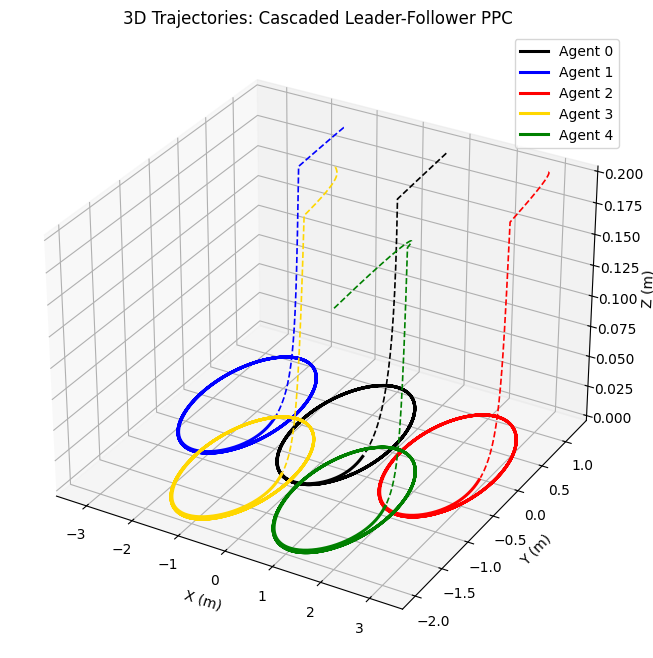
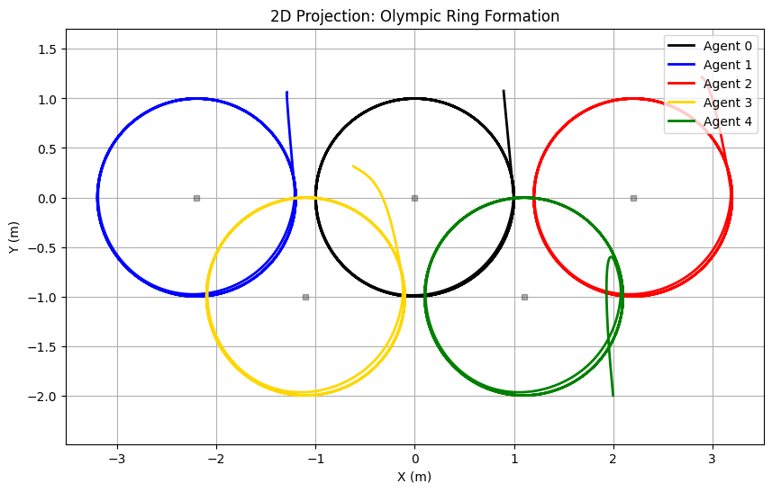

# 3D Multi-Agent Prescribed Performance Control (PPC): Olympic Rings Formation

This repository features an advanced 3D implementation of a multi-agent robotic system. Five robotic agents, modeled as **3-DOF SCARA-type arms**, collaborate to trace the Olympic Games logo. The system utilizes **Cascaded Leader-Follower Topology** and **Prescribed Performance Control (PPC)** to ensure high-precision trajectory tracking in a 3D workspace.

## Key Technical Enhancements
* **3D Workspace Integration:** The system controls $x$, $y$, and $z$ coordinates, enabling automated **Pen-Up/Pen-Down logic**.
* **Cascaded Tracking:** Real-world multi-agent behavior where followers track the actual physical position of their leaders rather than a virtual reference.
* **Inverse Kinematics Initialization:** Automatic calculation of initial joint states $q_0$ based on custom Cartesian starting points.
* **Collision Diagnostics:** Real-time monitoring of Tip-to-Tip, Elbow-to-Elbow, and Tip-to-Elbow distances across all 10 agent pairs.
* **Geometric Safety & Base Placement:** Bases are strategically positioned at the ring centers, and link lengths are strictly chosen as $l_1 = 0.7$ m and $l_2 = 0.7$ m to provide a mathematical guarantee against collisions.

---

## 1. Robotic Arm Kinematics (2R1P)

Each agent is a 3-DOF arm consisting of two revolute joints and one prismatic joint for vertical motion. The joint vector is defined as:

$$
q = [\theta_1, \theta_2, d_3]^T
$$

### Base Placement & Geometric Safety
To maximize reachability and inherently avoid physical interference, the base coordinate $[b_x, b_y, 0]^T$ of each robotic arm is placed exactly at the center of its respective target ring. Additionally, the link lengths were specifically designed as $l_1 = 0.7$ m and $l_2 = 0.7$ m. This combination of center-aligned bases and restricted arm spans geometrically guarantees that elbow-to-elbow and tip-to-elbow collisions are avoided throughout the execution of the formation.

### Forward Kinematics
The end-effector position $p(q) = [x, y, z]^T$ relative to the base is given by:

$$
p(q) = \begin{bmatrix} 
b_x + l_1 \cos(\theta_1) + l_2 \cos(\theta_1 + \theta_2) \\ 
b_y + l_1 \sin(\theta_1) + l_2 \sin(\theta_1 + \theta_2) \\ 
d_3 
\end{bmatrix}
$$

### 3D Jacobian Matrix
The velocity relationship $\dot{p} = J(q)\dot{q}$ utilizes a $3 \times 3$ Jacobian:

$$
J(q) = \begin{bmatrix} 
-l_1 \sin(\theta_1) - l_2 \sin(\theta_1 + \theta_2) & -l_2 \sin(\theta_1 + \theta_2) & 0 \\ 
l_1 \cos(\theta_1) + l_2 \cos(\theta_1 + \theta_2) & l_2 \cos(\theta_1 + \theta_2) & 0 \\ 
0 & 0 & 1 
\end{bmatrix}
$$

---

## 2. Prescribed Performance Control (PPC)

The controller ensures that the tracking error $e(t) = p(t) - p_{ref}(t)$ evolves strictly within a decaying exponential envelope.

### Performance Bounds
The error is constrained by the performance function $\rho(t)$:

$$
\rho(t) = (\rho_0 - \rho_\infty) e^{-lt} + \rho_\infty
$$

Where $\rho_0$ is the initial allowed error and $\rho_\infty$ is the maximum steady-state error.

### Control Law
By transforming the normalized error $\xi = e/\rho$ through a logarithmic function, we derive the joint velocity commands:

$$
u = \dot{q} = -k J^+(q) \epsilon, \quad \epsilon = \frac{1}{2} \ln \left( \frac{1 + \xi}{1 - \xi} \right)
$$

---

## 3. System Architecture

### Network Topology (Cascaded)
The agents follow a directed communication graph where followers track the **actual** positions of their leaders:
1.  **Agent 0 (Black):** Leader. Tracks the central circle reference.
2.  **Agents 1 (Blue) & 2 (Red):** Track Agent 0 with offsets $\Delta_{10}$ and $\Delta_{20}$.
3.  **Agents 3 (Yellow) & 4 (Green):** Track Agents 1 and 2 respectively with offsets $\Delta_{31}$ and $\Delta_{42}$.

For any follower $i$ tracking agent $j$, the reference is:

$$
p_{ref, i}(t) = p_j(t) + \Delta_{ij}
$$

### Operational Logic
* **Warm-up ($t < 2$ s):** Smooth interpolation from custom start points to the formation's entry point. **Pen-Up** mode ($z = 0.2$ m).
* **Drawing ($t \geq 2$ s):** High-speed circular tracking ($R = 1.0$, $\omega = -2.0$). **Pen-Down** mode ($z = 0.0$ m).

---

## 4. Diagnostics & Visualization

The simulation generates four detailed figures:
* **3D Workspace:** Visualizes the approach (dashed lines) and the drawing (solid lines) phases.
* **2D Projection:** A top-down view of the Olympic formation.
* **Error Envelopes:** Per-agent and per-dimension plots proving that tracking errors remain within $\pm \rho(t)$.
* **Collision Monitor:** Distance plots for all joint combinations, ensuring safety thresholds (0.15 m) are never violated.

## 5. Implementation Details
* **Language:** Python 3.x
* **Dependencies:** `numpy`, `matplotlib`
* **Solver:** Euler integration with velocity saturation for numerical stability.
